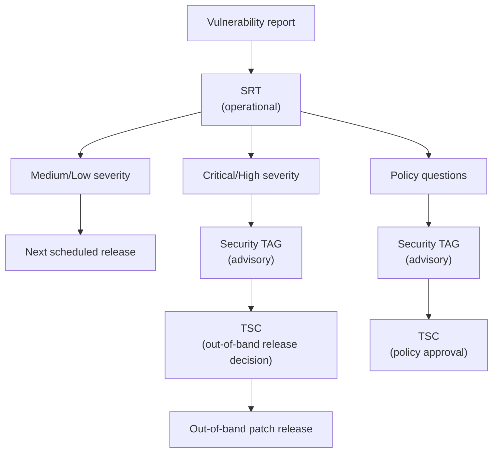

# Security Roles and Responsibilities

This document describes the two security governance bodies in the OpenSearch project: the **Security Response Team (SRT)** and the **Security Technical Advisory Group (TAG)**. They serve distinct but complementary functions.

## Security Response Team (SRT)

The SRT is the **operational** arm of OpenSearch security. It handles the day-to-day work of receiving, triaging, and coordinating fixes for security vulnerabilities.

### Responsibilities

- Monitor security@opensearch.org and GitHub private vulnerability reports.
- Acknowledge incoming reports within 48 hours.
- Triage and validate reports, assign CVSS scores.
- Create Draft GHSAs and reserve CVE IDs.
- Assemble Fix Teams and coordinate private fix development.
- Manage the vulnerability tracking board.
- Negotiate embargo timelines with reporters.
- Coordinate with release managers on patch timing.
- Send pre-disclosure and public disclosure communications using the [comms templates](comms-templates/).
- Maintain the pre-disclosure list.

### Membership

- New members are nominated by existing SRT members.
- Members should have experience as maintainers in the OpenSearch project and familiarity with security concepts (CVSS scoring, responsible disclosure, CVE process).
- To encourage diversity, no single organization should represent more than half of the SRT. If representation shifts due to job changes, the team should work to rebalance within 12 months.
- The SRT has no fixed size cap but should remain small enough to act quickly (target: 5–8 members).

### Stepping Down

Members may step down at any time and are encouraged to nominate a replacement. Members who are unreachable for more than 2 months or are not fulfilling their responsibilities may be removed by consensus of the remaining members.

### Current Members

| Name | GitHub | Affiliation |
| --- | --- | --- |
| Kunal Khatua | [@kkhatua](https://github.com/kkhatua) | Amazon |
| Craig Perkins | [@cwperks](https://github.com/cwperks) | Amazon |
| Shikhar Jain | [@shikharj05](https://github.com/shikharj05) | Amazon |
| Gulshan Kumar | [@kumargu](https://github.com/kumargu) | Amazon |
| Nils Bandener | [@nibix](https://github.com/nibix) | Eliatra |
| Nagaraj G | [@nagarajg17](https://github.com/nagarajg17) | Amazon |

### Emeritus

| Name | GitHub | Affiliation |
| --- | --- | --- |
| Ryan Liang | [@RyanL1997](https://github.com/RyanL1997) | Amazon |
| Varun Lodaya | [@varun-lodaya](https://github.com/varun-lodaya) | Amazon |
| Andriy Redko | [@reta](https://github.com/reta) | Aiven |
| Andrey Pleskach | [@willyborankin](https://github.com/willyborankin) | Aiven |

## Security Technical Advisory Group (TAG)

The Security TAG is the **advisory** arm. It champions the strategic direction and technical guidance for security across the OpenSearch ecosystem, and makes recommendations to the [TSC](https://github.com/opensearch-project/technical-steering-committee).

The full TAG charter, including scope, non-goals, decision process, and membership rotation, is maintained in the [technical-steering repo](https://github.com/opensearch-project/technical-steering/tree/main/technical-advisory-groups/security-tag).

### Responsibilities (as they relate to vulnerability response)

- Review and advise on severity ratings for Critical and High issues.
- Recommend out-of-band patch releases to the TSC.
- Escalate high-impact security concerns (critical vulnerabilities, supply-chain risks) to the TSC and SRT.
- Review and propose changes to security response policies (this repo's documentation).
- Periodically review the vulnerability tracking board to ensure issues are progressing.
- Participate in retrospectives for Critical and High severity incidents.

The TAG's broader responsibilities — security architecture guidance, dependency management practices, plugin hardening, community education — are defined in the [charter](https://github.com/opensearch-project/technical-steering/blob/main/technical-advisory-groups/security-tag/charter.md).

### Relationship to the TSC

The Security TAG is advisory — it **recommends** but does not enforce. Final decision-making (e.g., out-of-band release approval, policy changes) rests with the TSC.

### Current Members

| Name | GitHub | Affiliation |
| --- | --- | --- |
| Craig Perkins | [@cwperks](https://github.com/cwperks) | Amazon |
| Nils Bandener | [@nibix](https://github.com/nibix) | Eliatra |
| Aparajita Pandey | [@aparajita31pandey](https://github.com/aparajita31pandey) | Uber |
| Gulshan Kumar | [@kumargu](https://github.com/kumargu) | Amazon |
| Kunal Khatua | [@kkhatua](https://github.com/kkhatua) | Amazon |
| Andrey Pleskach | [@willyborankin](https://github.com/willyborankin) | Aiven |
| Shikhar Jain | [@shikharj05](https://github.com/shikharj05) | Amazon |
| Jochen Kressin | [@jochen-kressin](https://github.com/jochen-kressin) | Eliatra |

Membership follows the guidelines in the [TAGs README](https://github.com/opensearch-project/technical-steering/tree/main/technical-advisory-groups).

## How the SRT and TAG Work Together

| Scenario | SRT | Security TAG | TSC |
| --- | --- | --- | --- |
| New vulnerability report | Triages, scores, creates GHSA | — | — |
| Medium/Low severity fix | Coordinates fix, publishes on next release | Reviews if needed | — |
| Critical severity fix | Coordinates fix, requests out-of-band release | Recommends out-of-band release | Approves out-of-band release |
| High severity fix | Coordinates fix, consults TAG on release timing | Evaluates whether out-of-band is warranted | Approves if out-of-band recommended |
| Policy change (e.g., embargo terms) | Proposes change | Reviews and advises | Approves |
| Retrospective | Leads retrospective | Participates | — |

## Joining

If you are interested in joining the SRT or Security TAG, reach out to any current member or email security@opensearch.org. The best path to nomination is sustained contribution to security-related work in the OpenSearch project.
