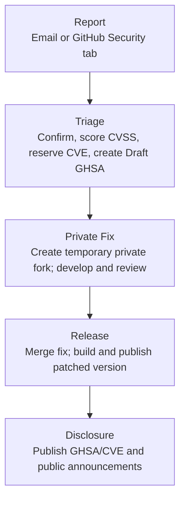

# Security Release Process

This document describes the end-to-end process for handling security vulnerabilities in OpenSearch, from initial report through patch release and public disclosure.

## Overview

```
Report → Triage → Private Fix → Review → Patch Release → Public Disclosure
```

The [Security Response Team (SRT)](README.md#security-response-team-srt) coordinates each phase. The [Security TAG](README.md#security-tag) advises on severity and release decisions.

## 1. Report Intake

A vulnerability report arrives through one of two channels:

- **Email**: security@opensearch.org
- **GitHub Security tab**: Private vulnerability reporting on any `opensearch-project` repository

See [INTAKE.md](INTAKE.md) for the full intake process.

Within **48 hours** of receipt, an SRT member will:

1. Acknowledge the report to the reporter.
2. Create a tracking entry on the vulnerability tracking board with status **Triage**.
3. Assess whether the report is valid and determine the affected repository/component.

## 2. Triage

The SRT evaluates the report and assigns a severity using [CVSS 3.1](https://www.first.org/cvss/v3.1/specification-document) via the [CVSS Calculator](https://www.first.org/cvss/calculator/3.1).

| Severity | CVSS Score | Typical Response |
| --- | --- | --- |
| Critical | 9.0–10.0 | Out-of-band patch release |
| High | 7.0–8.9 | Out-of-band if next release is >4 weeks away; otherwise next scheduled release |
| Medium | 4.0–6.9 | Next scheduled release |
| Low | 0.1–3.9 | Next scheduled release |

For Critical issues, an out-of-band release is expected regardless of effort. For High issues, the Security TAG evaluates whether the time-to-next-release justifies the cost of an out-of-band patch. Factors include active exploitation, availability of mitigations, and the current [patching effort constraints](https://github.com/opensearch-project/opensearch-build/issues/5720).

The SRT will:

1. Confirm the vulnerability and its scope.
2. Reserve a CVE ID if one has not already been assigned.
3. Create a [Draft GitHub Security Advisory (GHSA)](https://docs.github.com/en/code-security/security-advisories/working-with-repository-security-advisories/creating-a-repository-security-advisory) on the affected repository.
4. Negotiate an [embargo timeline](EMBARGO_POLICY.md) with the reporter.
5. Update the tracking board status to **In Review**.

## 3. Fix Development

Once triage is complete, the SRT organizes a Fix Team:

1. **Identify contributors**: The SRT identifies maintainers and contributors from the affected component who will develop the fix.
2. **Request a temporary private fork**: An `opensearch-admin` member creates a temporary private fork from the Draft GHSA. The Fix Team members are added as collaborators. See [PRIVATE_FIX_GUIDELINES.md](PRIVATE_FIX_GUIDELINES.md).
3. **Develop the fix**: The Fix Team works in the private fork. All commits must follow the [commit message guidelines](PRIVATE_FIX_GUIDELINES.md#commit-message-hygiene) — no security-signaling language.
4. **Review**: The fix is reviewed by at least one other maintainer of the affected component within the private fork.
5. Update the tracking board status to **Pending Release**.

### Timeline Targets

| Phase | Target |
| --- | --- |
| Triage complete | 7 days from report |
| Fix developed and reviewed | 14 days from triage |
| Patch released | Aligned with [release calendar](https://opensearch.org/releases/) or out-of-band |

These are targets, not hard deadlines. The SRT adjusts based on severity and complexity.

## 4. Release

OpenSearch releases on a [regular cadence](https://opensearch.org/releases/). Security fixes are included in the next scheduled release when possible.

### Disclosure Timing

GHSAs and CVEs are published only after patched artifacts are available to users. This means:

- The advisory is **not published when the fix is merged** — it is published when the release containing the fix is out.
- If a fix lands in `main` but the next minor release is weeks away, the advisory remains in draft until that release ships.
- Engineers and reporters should expect that disclosure is tied to the [release calendar](https://opensearch.org/releases/), not to when the code fix is ready.

This policy exists to protect users: publishing an advisory before a patched version is available tells adversaries about the issue without giving users a way to protect themselves.

### Patching Constraints

Today, producing a patch release (e.g., `2.x.1`) across the full OpenSearch distribution requires significant coordination effort across all components. Historically, the project has only shipped a small number of patch releases (see [opensearch-build#5720](https://github.com/opensearch-project/opensearch-build/issues/5720) for ongoing discussion).

This means that for Medium and Low severity issues, fixes typically ship in the next scheduled minor release rather than as an immediate patch.

The project is working toward more flexible component-level patching — plugins carry a 4th digit in their semver (e.g., `2.19.0.1`) that could enable individual plugin patches without a full distribution release. As this capability matures, the SRT will update this process to take advantage of it.

### Out-of-Band Releases

For Critical severity issues, the Security TAG will recommend an out-of-band patch release to the [Technical Steering Committee (TSC)](https://github.com/opensearch-project/technical-steering-committee). An out-of-band release requires TSC sign-off.

For High severity issues, the Security TAG evaluates whether an out-of-band release is warranted based on:

- **Time to next release**: If the next scheduled release is more than 4 weeks away, an out-of-band release is strongly recommended.
- **Active exploitation**: Evidence of exploitation in the wild triggers an immediate out-of-band release regardless of severity.
- **Mitigation availability**: If a configuration change or workaround effectively neutralizes the risk, the fix may ride the next scheduled release.
- **Patching effort**: Full distribution patch releases currently require [significant coordination](https://github.com/opensearch-project/opensearch-build/issues/5720). The TAG weighs this cost against the risk of waiting.

### Release Day

1. The Fix Team merges the private fork into the affected repository's release branch. Merges should be timed to minimize the window between merge and release.
2. Release managers build and publish the patched version.
3. The SRT updates the tracking board status to **Verified Fix**.
4. Once the patched version is publicly available, the SRT updates the tracking board to **Ready for Publication**.

## 5. Public Disclosure

After patches are available, the SRT publishes the advisory:

1. **Notify the pre-disclosure list** at least 24 hours before the public announcement ([template](comms-templates/release-day-headsup-email.md)).
2. **Publish the GHSA**: The Draft GHSA is published on the affected repository, which automatically requests a CVE from GitHub's CNA.
3. **Announce** via all public channels:
   - [OpenSearch Forum — Security](https://forum.opensearch.org/c/security/) ([template](comms-templates/vulnerability-announcement-forum.md))
   - The `#security` channel on [OpenSearch Slack](https://opensearch.org/slack.html) ([template](comms-templates/vulnerability-announcement-slack.md))
   - Email announcement ([template](comms-templates/vulnerability-announcement-email.md))
   - The project's release notes

See the [comms-templates](comms-templates/) directory for all templates used throughout this process.

## 6. Post-Disclosure

- If new information emerges, the SRT updates the published GHSA.
- The SRT conducts a brief retrospective for Critical and High severity issues to identify process improvements.
- Lessons learned are shared with the Security TAG.

## Publicly Known Vulnerabilities

If a vulnerability is already publicly known (e.g., a CVE in a dependency), there is no need for an embargo. Anyone may open a public GitHub issue to discuss it. The SRT will still coordinate the fix and track it on the board.

## Infrastructure and CI/CD Vulnerabilities

Not all security issues affect the official released artifacts. Vulnerabilities in the project's CI/CD infrastructure, build pipelines, GitHub Actions workflows, or other tooling are handled through the same SRT process but disclosed differently:

- **Product repos** (e.g., `OpenSearch`, `OpenSearch-Dashboards`, `security`): GHSAs and CVEs are published on the affected repo. This signals that the official artifacts for that repo are impacted and users should upgrade.
- **Infrastructure issues**: GHSAs are published on the `security-response` repository (or another dedicated repo) since the released binaries are not directly affected. These advisories are still important for transparency and for anyone running similar infrastructure.

The SRT will determine the appropriate repo for disclosure during triage based on whether end-user artifacts are impacted.

## Summary Flowchart



## FAQ

### Why hasn't the GHSA/CVE been published yet if the fix is already merged?

GHSAs and CVEs are published only after patched artifacts (official binaries) are available. Publishing an advisory before users can upgrade exposes the issue without giving them a way to protect themselves. If the fix is merged but the next release hasn't shipped yet, the advisory stays in draft.

### Can we do a patch release just for a security fix?

Out-of-band patch releases require a recommendation from the Security TAG and sign-off from the TSC. For Critical issues, an out-of-band release is expected. For High issues, the TAG evaluates whether the time-to-next-release, active exploitation, and mitigation availability justify the [patching effort](https://github.com/opensearch-project/opensearch-build/issues/5720). For Medium and Low, fixes ride the next scheduled release.

### Can a single plugin ship a security patch independently?

Plugins carry a 4th semver digit (e.g., `2.19.0.1`) that could enable this, but the project doesn't currently use it for independent patch releases. This is an area of active improvement. As component-level patching matures, the SRT will update this process.

### I'm a reporter — when will I hear back?

Within 48 hours of your report. See [INTAKE.md](INTAKE.md) for the full timeline.

### Who decides if an issue warrants an out-of-band release?

The Security TAG makes a recommendation to the TSC based on severity, active exploitation, and availability of mitigations. The TSC makes the final call.
